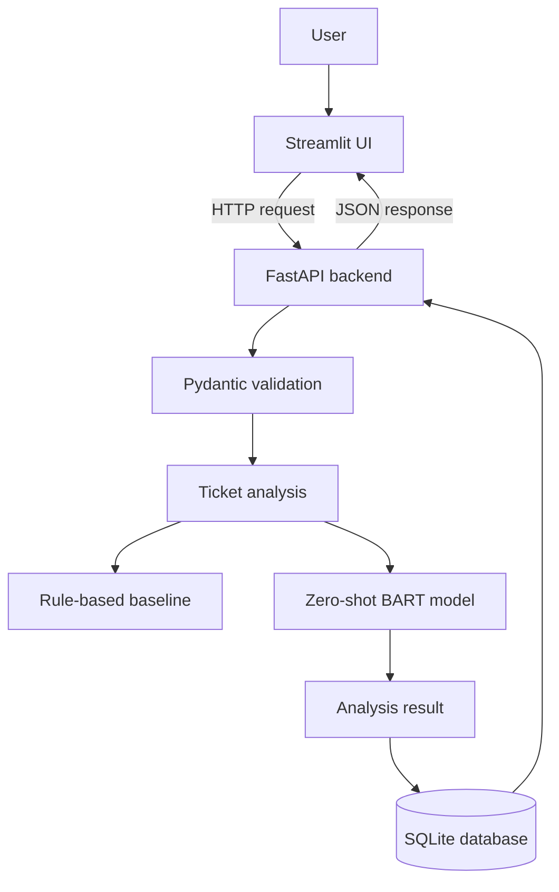
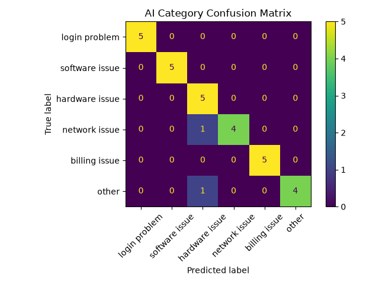
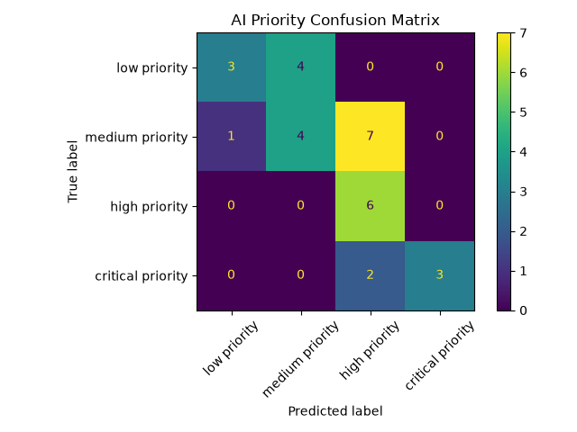

# AI Helpdesk Ticket Assistant

An AI-powered helpdesk ticket analysis application built with Python, FastAPI, Hugging Face Transformers, SQLite, and Streamlit.

The project was created as a portfolio project to practice building a complete AI application - from a simple rule-based baseline, through zero-shot classification, to a backend API, database, user interface, automated tests, and model evaluation.

## Features

The application can:

- classify helpdesk tickets into predefined categories,
- assign a priority level,
- return confidence scores from the AI model,
- flag uncertain predictions for human review,
- create a simple ticket summary,
- suggest a predefined response based on the detected category,
- expose the analysis through a FastAPI backend,
- store analyzed tickets in SQLite,
- display ticket history,
- provide a Streamlit user interface,
- compare a rule-based baseline with a zero-shot AI model,
- evaluate classification performance using multiple metrics.

## Ticket Categories

The application supports the following categories:

- `login problem`
- `software issue`
- `hardware issue`
- `network issue`
- `billing issue`
- `other`

## Priority Levels

The available priority levels are:

- `low priority`
- `medium priority`
- `high priority`
- `critical priority`

---

## Where AI Is Used

The AI model is used for two tasks:

1. **Ticket category classification**
2. **Ticket priority classification**

The project uses the Hugging Face model:

`facebook/bart-large-mnli`

with a zero-shot classification pipeline.

This means that the model receives the ticket text together with possible labels and selects the label that best matches the ticket.

Example:

```text
Ticket:
"The office Wi-Fi keeps disconnecting."

Possible labels:
- login problem
- software issue
- hardware issue
- network issue
- billing issue
- other

Prediction:
network issue
```

The model also returns a confidence score.

If either the category confidence or priority confidence is below:

```python
0.60
```

the application sets:

```python
requires_human_review = True
```

### Important

Not every part of the application uses AI.

The following parts are rule-based:

- ticket summary - created by shortening the original text,
- suggested response - selected from predefined response templates,
- human review decision - based on a confidence threshold.

The project intentionally keeps these parts simple instead of presenting them as AI-generated.

---

## Rule-Based Baseline

Before adding the AI model, a simple keyword-based classifier was created.

Example:

```python
if "password" in text:
    category = "login problem"
```

This baseline does **not** use AI.

Its purpose is to provide a simple reference point that can later be compared with the zero-shot model.

The project keeps both approaches:

```python
detect_category_baseline()
detect_category_with_ai()
```

and similar functions for priority classification.

---

## Architecture



In simplified form:

```text
User
  ↓
Streamlit
  ↓ HTTP
FastAPI
  ↓
Pydantic validation
  ↓
AI classification
  ↓
SQLite
  ↓
JSON response
  ↓
Streamlit
```

### Main responsibilities

**Streamlit**
- user interface,
- sends requests to FastAPI,
- displays analysis results,
- displays ticket history.

**FastAPI**
- backend server,
- receives HTTP requests,
- validates input,
- runs ticket analysis,
- communicates with SQLite,
- returns JSON responses.

**SQLite**
- stores analyzed tickets permanently.

**Hugging Face Transformers**
- performs zero-shot category and priority classification.

---

## Example API Request

### `POST /analyze-ticket`

Request:

```json
{
  "text": "I cannot log in to my account. Password reset does not work."
}
```

Example response:

```json
{
  "category": "login problem",
  "category_confidence": 0.84,
  "priority": "high priority",
  "priority_confidence": 0.63,
  "summary": "I cannot log in to my account. Password reset does not work.",
  "suggested_response": "Please confirm whether an error message appears during login.",
  "requires_human_review": false
}
```

The analyzed ticket is also stored in the SQLite database.

---

## API Endpoints

### `GET /`

Checks whether the API is running.

Example response:

```json
{
  "message": "AI Helpdesk Ticket Assistant API is running.",
  "status": "ok"
}
```

### `POST /analyze-ticket`

Analyzes a new helpdesk ticket using the zero-shot AI model.

### `GET /tickets`

Returns the history of previously analyzed tickets stored in SQLite.

---

## SQLite Database

The application stores analyzed tickets in a local SQLite database.

Each record contains:

- ticket ID,
- original ticket text,
- predicted category,
- category confidence,
- predicted priority,
- priority confidence,
- summary,
- suggested response,
- human review flag,
- creation timestamp.

The project uses Python's built-in:

```python
sqlite3
```

module without SQLAlchemy.

SQL parameters are used when inserting data:

```python
connection.execute(
    "INSERT INTO tickets (ticket_text, category) VALUES (?, ?)",
    (ticket_text, category),
)
```

This keeps user data separate from SQL commands and protects against SQL injection caused by directly concatenating user input into SQL queries.

---

## Model Evaluation

The project contains a small manually labelled evaluation dataset:

```text
data/evaluation_tickets.csv
```

It contains 30 example helpdesk tickets with expected:

- categories,
- priorities.

The evaluation compares the rule-based baseline with the zero-shot AI model.

### Accuracy Results

| Method | Category Accuracy | Priority Accuracy |
|---|---:|---:|
| Rule-based baseline | 93.33% | 83.33% |
| Zero-shot AI model | 93.33% | 53.33% |

### Interpretation

The zero-shot model performed very well for ticket category classification and correctly classified 28 out of 30 category examples.

Priority classification was significantly more difficult.

The model frequently overpredicted:

```text
high priority
```

especially for tickets labelled as:

```text
medium priority
```

The priority confusion matrix showed that 7 out of 12 medium-priority tickets were incorrectly classified as high priority.

This demonstrates why model evaluation is important — adding AI does not automatically make a system better than a simple rule-based solution.

---

## Classification Metrics

The evaluation script also calculates:

- accuracy,
- precision,
- recall,
- F1-score,
- confusion matrix.

Example results for AI priority classification:

| Priority | Precision | Recall | F1-score |
|---|---:|---:|---:|
| Low | 0.75 | 0.43 | 0.55 |
| Medium | 0.50 | 0.33 | 0.40 |
| High | 0.40 | 1.00 | 0.57 |
| Critical | 1.00 | 0.60 | 0.75 |

The `high priority` class achieved perfect recall, meaning all real high-priority tickets were detected.

However, its precision was only `0.40`, because the model also incorrectly classified many medium and critical tickets as high priority.

---

## Confusion Matrices

### Category Classification



Category classification achieved:

```text
93.33% accuracy
```

The model made only two category errors:

- one network issue was classified as a hardware issue,
- one `other` ticket was classified as a hardware issue.

### Priority Classification



Priority classification achieved:

```text
53.33% accuracy
```

The main error pattern was:

```text
medium priority → high priority
```

---

## Error Analysis

The evaluation also prints incorrectly classified tickets together with:

- expected label,
- predicted label,
- confidence score.

Example:

```text
Text:
My monitor does not turn on.

Expected:
medium priority

Predicted:
high priority

Confidence:
0.3423
```

Many incorrect predictions had confidence scores below `0.60`, which supports the use of the human review threshold.

However, some incorrect predictions had confidence scores above the threshold.

This demonstrates an important limitation:

> A high confidence score does not guarantee that a model prediction is correct.

---

## Zero-Shot Label Experiment

During development, the priority label descriptions were modified to make the business rules more explicit.

Initial AI priority accuracy:

```text
53.33%
```

After changing the priority descriptions:

```text
50.00%
```

Because the change reduced performance, the original descriptions were restored.

This experiment showed that more detailed zero-shot label descriptions do not necessarily improve model performance and that changes should be validated through evaluation rather than intuition alone.

---

## Automated Tests

The project uses `pytest`.

Tests include:

- baseline category classification,
- ticket summary logic,
- human review threshold,
- FastAPI root endpoint,
- empty ticket validation,
- missing request fields,
- successful ticket analysis endpoint.

Run tests with:

```bash
python -m pytest -v
```

The FastAPI tests avoid loading the full BART model by replacing the AI analysis with a lightweight test implementation where appropriate.

This keeps automated tests fast while still testing API behaviour.

---

## Project Structure

```text
ai-helpdesk-assistant/
│
├── app/
│   ├── __init__.py
│   ├── classifier.py
│   ├── database.py
│   ├── main.py
│   └── schemas.py
│
├── data/
│   └── evaluation_tickets.csv
│
├── tests/
│   ├── test_classifier.py
│   └── test_api.py
│
├── screenshots/
│   ├── category_confusion_matrix.png
│   └── priority_confusion_matrix.png
│
├── main.py
├── streamlit_app.py
├── evaluate.py
├── requirements.txt
├── .gitignore
└── README.md
```

### Important files

`app/classifier.py`

Contains:

- baseline classification,
- zero-shot classification,
- confidence handling,
- summary function,
- suggested responses.

`app/main.py`

Contains the FastAPI backend and API endpoints.

`app/schemas.py`

Contains Pydantic request and response models.

`app/database.py`

Contains SQLite database logic.

`streamlit_app.py`

Contains the graphical user interface.

`evaluate.py`

Evaluates baseline and AI classification performance.

`tests/`

Contains automated pytest tests.

`main.py`

Provides a simple command-line comparison between the baseline and AI classifier.

---

## Technologies

- Python
- FastAPI
- Uvicorn
- Pydantic
- Hugging Face Transformers
- PyTorch
- BART Large MNLI
- Zero-shot classification
- SQLite
- Streamlit
- Requests
- pytest
- scikit-learn
- Matplotlib
- Git
- GitHub

---

## Installation

### 1. Clone the repository

```bash
git clone YOUR_REPOSITORY_URL
```

Enter the project directory:

```bash
cd ai-helpdesk-assistant
```

### 2. Create a virtual environment

Linux / WSL:

```bash
python3 -m venv .venv
```

Activate it:

```bash
source .venv/bin/activate
```

### 3. Install dependencies

```bash
python -m pip install -r requirements.txt
```

The Hugging Face model will be downloaded automatically the first time it is used.

---

## Running the Application

The application uses two separate processes:

```text
FastAPI → port 8000
Streamlit → port 8501
```

### Terminal 1 — FastAPI

Activate the virtual environment:

```bash
source .venv/bin/activate
```

Run:

```bash
python -m uvicorn app.main:app
```

FastAPI will be available at:

```text
http://127.0.0.1:8000
```

Interactive API documentation:

```text
http://127.0.0.1:8000/docs
```

### Terminal 2 — Streamlit

Activate the virtual environment:

```bash
source .venv/bin/activate
```

Run:

```bash
streamlit run streamlit_app.py
```

The interface will be available at:

```text
http://localhost:8501
```

---

## Running the Evaluation

Run:

```bash
python evaluate.py
```

The script:

1. loads the evaluation dataset,
2. runs the rule-based baseline,
3. runs the zero-shot model,
4. compares predictions with expected labels,
5. calculates evaluation metrics,
6. prints classification errors,
7. generates confusion matrices.

---

## Limitations

This project is intentionally designed for portfolio application and is not intended to be a production helpdesk system.

Current limitations include:

- the evaluation dataset contains only 30 manually labelled tickets,
- some evaluation examples contain keywords also used by the baseline rules,
- priority classification performance is relatively weak,
- BART Large MNLI is relatively large and slow on CPU,
- priority definitions are subjective and would normally depend on company-specific business rules,
- the summary is created using simple text shortening rather than an AI summarization model,
- suggested responses are predefined templates rather than generated responses,
- there is no authentication or user management,
- SQLite is suitable for this project but would have limitations in a larger multi-user system.

---

## Future Improvements

Possible improvements include:

- expanding the evaluation dataset,
- adding more realistic and ambiguous helpdesk tickets,
- improving priority classification,
- comparing additional zero-shot models,
- testing smaller and faster models,
- adding a dedicated AI summarization model,
- generating suggested responses using an LLM,
- adding `GET /tickets/{ticket_id}`,
- improving the Streamlit interface,
- adding filtering and searching to ticket history,
- adding model configuration through environment variables,
- adding more API and database tests,
- deploying the application.

---

## What I Learned

This project helped me understand:

- how a rule-based baseline differs from an AI model,
- how zero-shot classification works,
- how confidence scores should be interpreted,
- why model evaluation is necessary,
- how to perform basic error analysis,
- how precision, recall, F1-score, and confusion matrices work,
- how FastAPI handles requests and responses,
- how Pydantic validates incoming data,
- how Streamlit communicates with a backend through HTTP,
- how SQLite stores application data,
- how automated tests can be written with pytest,
- how different parts of an AI application can be separated into simple modules.

---

## Project Summary

The project started with a simple rule-based classifier and was gradually extended with a zero-shot Transformers model.

The final application combines:

```text
rule-based baseline
        +
zero-shot NLP model
        +
FastAPI backend
        +
Pydantic validation
        +
SQLite storage
        +
Streamlit interface
        +
pytest tests
        +
model evaluation
```

The project demonstrates not only how to integrate an AI model into an application, but also how to evaluate its limitations and compare it against a simpler baseline.